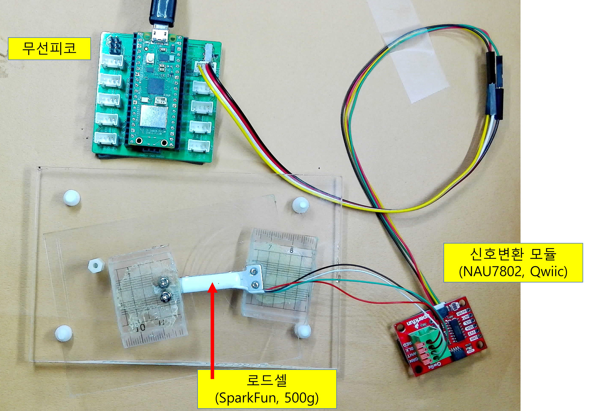
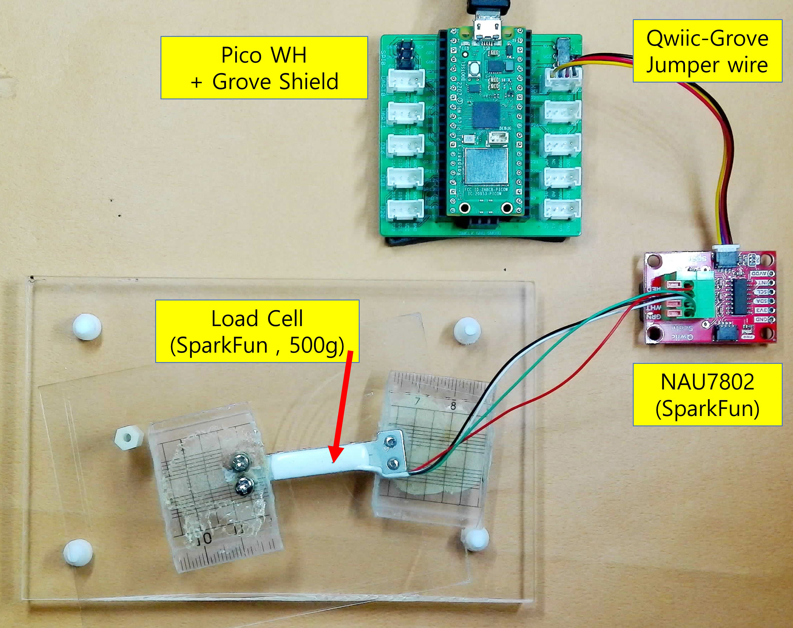

# pico_NAU7802_micropython
An Example of Micropython to make a pico_scale with 500g load cell and NAU7802 A/D Converter 

 
Up-down view:

 

Side view:

 
Changes in zero point over time:

 
I made a WiFI Scale for the student's experiment.
 
https://blog.naver.com/phy2sci/223855241194
